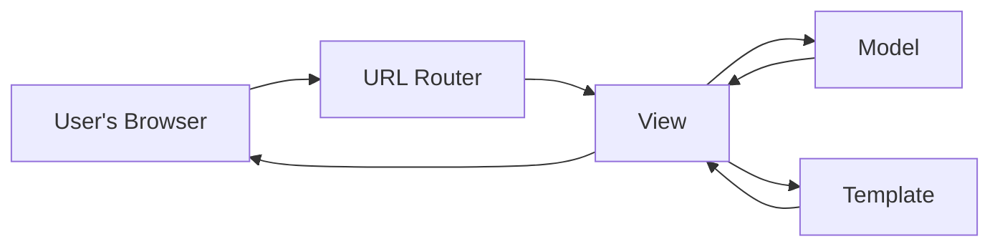

## What is MVT in Django?

**MVT** stands for **Model-View-Template** — it's the architectural pattern Django uses to organize your code. Think of it like a restaurant: someone takes the order, someone cooks the food, and someone presents the meal — each role is separate so things stay organized.

### 1. Model
- **What:** A Python class that represents a database table.
- **Why:** Instead of writing raw SQL, you define your data structure in Python, and Django's ORM (Object-Relational Mapper) translates it into database operations.
- **Example:** A `Product` model with `name`, `price`, and `stock` fields represents a `products` table.

### 2. View
- **What:** A Python function or class that receives a web request, decides what data is needed (often by asking the Model), and returns a response.
- **Why:** This is where your **logic** lives — "what should happen when a user visits this page?"
- **Example:** A view might fetch all products from the `Product` model and send them to a template.

### 3. Template
- **What:** An HTML file with special Django syntax (like `{{ product.name }}`) that defines how data is **displayed**.
- **Why:** Keeps presentation (HTML/CSS) separate from logic (Python), so designers and developers can work independently.

### How they connect

1. A user requests a URL.
2. Django's URL router sends the request to the right **View**.
3. The **View** asks the **Model** for data (if needed).
4. The **View** passes that data to a **Template**.
5. The **Template** renders HTML, which the **View** sends back as the response.

### Why not "MVC"?
You may have heard of **MVC (Model-View-Controller)** from other frameworks. Django uses similar ideas but different names:

| MVC term | Django equivalent | Role |
|---|---|---|
| Model | Model | Same — data layer |
| View | Template | Displays data |
| Controller | View | Handles logic and requests |

Django jokes that it's "MVC, but the framework is the controller" — Django itself handles URL routing, so your "View" in Django is really closer to a traditional "Controller."

### Common mistake
Beginners often put too much logic in templates (like complex calculations). **Best practice:** keep templates focused on display only, and put logic in views or models.

Would you like to see this pattern applied to a real example, like the `orders` app in your `examples/heavyaura-shop` folder?
